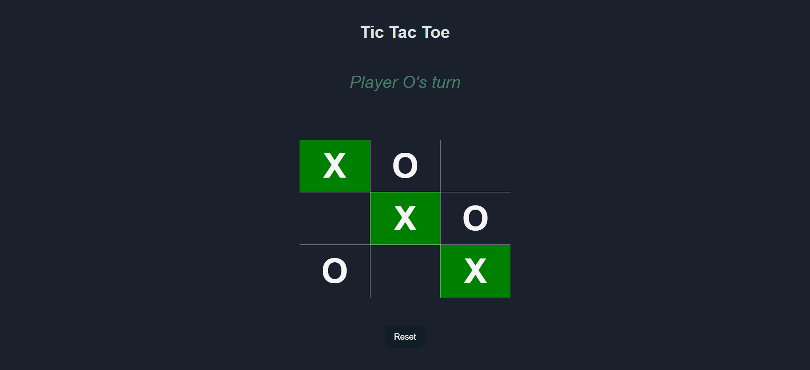

# Tic Tac Toe game

This is a simple implementation of the Tic Tac Toe game for the The Odin Project's fullstack [curriculum](https://www.theodinproject.com/lessons/node-path-javascript-tic-tac-toe).


## Screenshots




## Made with

- HTML
- CSS
- JavaScript

That's it! No frameworks or libraries were used in this project.

## Some key code snippets

Updates the DOM with the current state of the board
```javascript
    const render = () => {
        const boardElement = document.getElementById("board");
        boardElement.innerHTML = "";
        for (let i = 0; i < 9; i++) {
            const cellDataIndex = i + 1;
            const cell = document.createElement("div");
            cell.innerHTML = board[i] || "";
            cell.classList.add("cell");
            cell.setAttribute("data-index", cellDataIndex);
            boardElement.appendChild(cell);
        }
    };
```

Main game loop

```javascript
        function handleBoard (event) {
        const cell = event.target;
        const index = cell.getAttribute("data-index") - 1;
        
        if (GameBoard.getBoard()[index] === "") {
            GameBoard.setOption(index, currentPlayer);
            GameBoard.render();
            if (currentPlayer === "X") {
                currentPlayer = "O";
            } else {
                currentPlayer = "X";
            }

            updateStatus(currentPlayer);

            const {isGameOver, winner, winningCombo } = GameBoard.checkIsGameOver();

            const isDraw = GameBoard.isDraw();
            if (isDraw) {
                GameBoard.render();
                setTimeout(() => {
                    alert("It's a draw!");
                }, 100);
                return;
            }

            if (isGameOver) {
                GameBoard.render();
                GameBoard.paintWinningCombo(winningCombo);
                setTimeout(() => {
                    alert(`Player ${winner} wins!`);
                }, 100);
                removeEventListeners();
            }

        }
    }
```


## How to play

Just open the `index.html` file in your browser and start playing!

## Features

- Two players can play the game
- The game will display the winner or a draw
- The game will display the current player's turn

### Features to be added

- A computer player
- A score system

## Author

👤 **Robert Ramirez**

- Github: [@Robertron624](https://github.com/Robertron624)